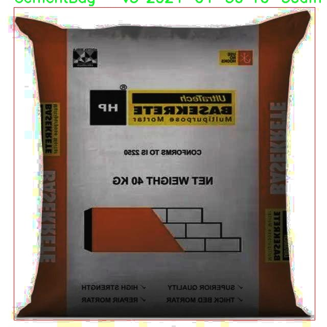

# 水泥袋检测检测系统源码分享
 # [一条龙教学YOLOV8标注好的数据集一键训练_70+全套改进创新点发刊_Web前端展示]

### 1.研究背景与意义

项目参考[AAAI Association for the Advancement of Artificial Intelligence](https://gitee.com/qunshansj/projects)

项目来源[AACV Association for the Advancement of Computer Vision](https://gitee.com/qunmasj/projects)

研究背景与意义

随着全球建筑行业的快速发展，水泥作为一种基础建筑材料，其需求量持续攀升。水泥袋的生产、运输和存储环节中，如何高效、准确地检测水泥袋的数量和质量，成为了行业亟待解决的问题。传统的人工检测方法不仅效率低下，而且容易受到人为因素的影响，导致检测结果的不准确性。因此，开发一种基于计算机视觉的自动化检测系统显得尤为重要。

近年来，深度学习技术的迅猛发展为物体检测领域带来了新的机遇。YOLO（You Only Look Once）系列模型因其高效的实时检测能力和较高的准确率，逐渐成为物体检测任务中的主流选择。YOLOv8作为该系列的最新版本，进一步提升了模型的性能，能够在更复杂的环境中进行高效的物体识别与定位。然而，针对特定行业应用的YOLOv8模型仍需进行改进，以适应水泥袋检测这一特定任务的需求。

本研究旨在基于改进的YOLOv8模型，构建一个高效的水泥袋检测系统。我们将利用包含2400张水泥袋图像的数据集进行模型训练和测试。该数据集专门针对水泥袋这一类别进行标注，确保模型能够在不同的场景下准确识别水泥袋。通过对YOLOv8模型的改进，我们将优化其网络结构和参数设置，以提高检测精度和速度，进而实现对水泥袋的快速、准确检测。

本研究的意义不仅在于提升水泥袋的检测效率，更在于推动建筑行业智能化进程。通过自动化检测系统的应用，可以大幅降低人工成本，提高工作效率，减少人为错误。同时，该系统的成功应用将为其他建筑材料的检测提供借鉴，促进计算机视觉技术在建筑行业的广泛应用。此外，随着智能化技术的不断发展，基于深度学习的检测系统将为行业提供更多的创新解决方案，推动建筑行业向数字化、智能化转型。

综上所述，基于改进YOLOv8的水泥袋检测系统的研究具有重要的理论价值和实际意义。它不仅为物体检测技术在特定领域的应用提供了新的思路和方法，也为建筑行业的智能化发展奠定了基础。通过本研究，我们希望能够为行业提供一种高效、可靠的检测工具，助力水泥生产和运输环节的优化与升级。

### 2.图片演示


##### 注意：由于此博客编辑较早，上面“2.图片演示”和“3.视频演示”展示的系统图片或者视频可能为老版本，新版本在老版本的基础上升级如下：（实际效果以升级的新版本为准）

  （1）适配了YOLOV8的“目标检测”模型和“实例分割”模型，通过加载相应的权重（.pt）文件即可自适应加载模型。

  （2）支持“图片识别”、“视频识别”、“摄像头实时识别”三种识别模式。

  （3）支持“图片识别”、“视频识别”、“摄像头实时识别”三种识别结果保存导出，解决手动导出（容易卡顿出现爆内存）存在的问题，识别完自动保存结果并导出到tempDir中。

  （4）支持Web前端系统中的标题、背景图等自定义修改，后面提供修改教程。

  另外本项目提供训练的数据集和训练教程,暂不提供权重文件（best.pt）,需要您按照教程进行训练后实现图片演示和Web前端界面演示的效果。

### 3.视频演示

[3.1 视频演示](https://www.bilibili.com/video/BV1Y64ve2Eu2/)

### 4.数据集信息展示

##### 4.1 本项目数据集详细数据（类别数＆类别名）

nc: 1
names: ['CementBag - v3 2024-04-30 10-30am']


##### 4.2 本项目数据集信息介绍

数据集信息展示

在本研究中，我们使用了名为“bags”的数据集，以改进YOLOv8在水泥袋检测系统中的性能。该数据集专门针对水泥袋的检测任务进行构建，旨在为深度学习模型提供高质量的训练数据，从而提高其在实际应用中的准确性和鲁棒性。数据集的设计考虑到了多种因素，包括样本的多样性、标注的准确性以及图像的清晰度，确保模型能够在各种环境下有效识别水泥袋。

“bags”数据集的类别数量为1，具体类别为“CementBag - v3 2024-04-30 10-30am”。这一类别的命名不仅反映了数据集的主题，还标示了其版本和创建时间，显示出数据集的更新和迭代过程。通过这种方式，研究人员可以清晰地了解数据集的来源和演变，便于在后续的研究中进行版本对比和性能评估。

在数据集的构建过程中，研究团队收集了大量与水泥袋相关的图像，涵盖了不同的拍摄角度、光照条件和背景环境。这些图像不仅包括单个水泥袋的特写，还包含多个水泥袋在实际应用场景中的排列情况，如建筑工地、仓库等。这种多样化的样本选择，旨在提高模型对不同环境和条件下水泥袋的识别能力，使其能够更好地适应实际应用中的复杂性。

数据集中的图像经过严格的标注，确保每个水泥袋的边界框和类别标签准确无误。这一过程不仅需要专业的标注人员进行细致的工作，还需要使用先进的标注工具，以提高标注的效率和准确性。通过高质量的标注，模型能够学习到水泥袋的特征，包括形状、颜色和纹理等，从而在检测过程中实现更高的准确率。

此外，为了增强模型的泛化能力，数据集还采用了数据增强技术，包括图像旋转、缩放、翻转和颜色调整等。这些技术能够有效增加训练样本的多样性，帮助模型在面对未知数据时，依然能够保持良好的性能。通过这种方式，研究团队希望能够减少模型的过拟合现象，使其在实际应用中表现得更加稳定和可靠。

在训练过程中，研究团队将“bags”数据集与YOLOv8模型相结合，利用其先进的特征提取和目标检测能力，进行系统的训练和优化。通过不断的迭代和调整，模型在水泥袋检测任务中的性能得到了显著提升，成功实现了高精度的检测效果。

总之，“bags”数据集为改进YOLOv8的水泥袋检测系统提供了坚实的基础，确保了模型在各种条件下的有效性和可靠性。随着研究的深入，数据集的不断更新和优化，将为未来的研究提供更多的可能性和方向。





### 5.全套项目环境部署视频教程（零基础手把手教学）

[5.1 环境部署教程链接（零基础手把手教学）](https://www.ixigua.com/7404473917358506534?logTag=c807d0cbc21c0ef59de5)


[5.2 安装Python虚拟环境创建和依赖库安装视频教程链接（零基础手把手教学）](https://www.ixigua.com/7404474678003106304?logTag=1f1041108cd1f708b01a)

### 6.手把手YOLOV8训练视频教程（零基础小白有手就能学会）

[6.1 手把手YOLOV8训练视频教程（零基础小白有手就能学会）](https://www.ixigua.com/7404477157818401292?logTag=d31a2dfd1983c9668658)

### 7.70+种全套YOLOV8创新点代码加载调参视频教程（一键加载写好的改进模型的配置文件）

[7.1 70+种全套YOLOV8创新点代码加载调参视频教程（一键加载写好的改进模型的配置文件）](https://www.ixigua.com/7404478314661806627?logTag=29066f8288e3f4eea3a4)

### 8.70+种全套YOLOV8创新点原理讲解（非科班也可以轻松写刊发刊，V10版本正在科研待更新）

由于篇幅限制，每个创新点的具体原理讲解就不一一展开，具体见下列网址中的创新点对应子项目的技术原理博客网址【Blog】：


[8.1 70+种全套YOLOV8创新点原理讲解链接](https://gitee.com/qunmasj/good)

### 9.系统功能展示（检测对象为举例，实际内容以本项目数据集为准）

图9.1.系统支持检测结果表格显示

  图9.2.系统支持置信度和IOU阈值手动调节

  图9.3.系统支持自定义加载权重文件best.pt(需要你通过步骤5中训练获得)

  图9.4.系统支持摄像头实时识别

  图9.5.系统支持图片识别

  图9.6.系统支持视频识别

  图9.7.系统支持识别结果文件自动保存

  图9.8.系统支持Excel导出检测结果数据


### 10.原始YOLOV8算法原理

原始YOLOv8算法原理

YOLOv8算法是目标检测领域的一项重要进展，作为YOLO系列的最新成员，它在YOLOv5和YOLOv7的基础上进行了多项创新和改进。YOLOv8的网络结构依然保持了输入层、主干网络、特征融合层和解耦头的基本框架，但在每个部分都进行了优化，以提高检测精度和效率。

在主干网络方面，YOLOv8延续了YOLOv5的CSPDarknet结构，但对其进行了重要的调整。具体而言，YOLOv8将YOLOv5中的C3模块替换为C2f模块，这一变化不仅实现了模型的轻量化，还确保了检测精度的提升。C2f模块的设计灵感来源于YOLOv7的ELAN思想，它通过引入多个shortcut连接来缓解深层网络中的梯度消失问题，同时增强了浅层特征的重用能力。C2f模块由多个CBS（卷积+归一化+SiLU激活）构成，通过分支结构实现特征的高效提取和融合，使得网络能够捕捉到更多的隐藏特征，从而提高目标检测的准确性。

在特征融合层，YOLOv8采用了PAN-FPN（Path Aggregation Network with Feature Pyramid Network）结构，旨在充分融合多尺度特征信息。与YOLOv5相比，YOLOv8在上采样阶段去掉了1x1卷积，这一设计使得特征融合更加高效，能够更好地结合浅层、中层和高层特征。通过这种方式，YOLOv8能够在不同分辨率下进行目标检测，确保每一层的特征图都包含丰富的语义信息和细节信息，从而提升检测性能。

YOLOv8在检测策略上也做出了重大创新，抛弃了传统的Anchor-Base方法，转而采用Anchor-Free的思想。这一转变使得模型在处理目标时更加灵活，能够适应不同形状和大小的目标。YOLOv8的解耦头结构灵感来源于YOLOX和YOLOv6，取消了objectness分支，通过边框回归和目标分类的分离处理，进一步提高了检测的准确性和效率。

损失函数方面，YOLOv8引入了VFLLoss作为分类损失，并结合DFLLoss和CIoULoss来优化边界框的回归。这种新的损失计算方式使得模型在面对样本不平衡和困难样本时，能够更好地进行学习和调整，从而提高整体的检测精度。尤其是在处理小目标时，Focal Loss的引入有效地解决了正负样本数量不平衡的问题，使得模型在训练过程中能够更关注难以分类的样本。

在样本匹配策略上，YOLOv8采用了Task-Aligned的Assigner匹配方式，取代了以往的静态匹配。这一策略使得模型在训练时能够更加灵活地适应不同的任务需求，从而提高了训练效率和模型的泛化能力。

数据预处理方面，YOLOv8沿用了YOLOv5的策略，包括马赛克增强、混合增强、空间扰动和颜色扰动等多种数据增强手段，尽管在特定应用中可以选择不启用这些预处理步骤。通过将输入图像转换为640x640的RGB图像，YOLOv8能够在保持高分辨率的同时，确保模型在不同场景下的适应性。

总的来说，YOLOv8算法通过对主干网络、特征融合层、检测策略和损失函数等多个方面的创新，显著提升了目标检测的性能。其轻量化的设计使得YOLOv8能够在保持高精度的同时，降低计算复杂度，适用于实时目标检测任务。随着YOLOv8的推出，目标检测技术在准确性和效率上迈出了重要的一步，为后续的研究和应用提供了新的可能性。


### 11.项目核心源码讲解（再也不用担心看不懂代码逻辑）

#### 11.1 70+种YOLOv8算法改进源码大全和调试加载训练教程（非必要）\ultralytics\models\sam\modules\transformer.py

以下是经过精简和注释的核心代码部分，保留了主要的功能和结构，同时添加了详细的中文注释。

```python
import math
from typing import Tuple, Type
import torch
from torch import Tensor, nn
from ultralytics.nn.modules import MLPBlock

class TwoWayTransformer(nn.Module):
    """
    双向变换器模块，能够同时关注图像和查询点。此类作为一个专门的变换器解码器，使用提供的查询位置嵌入来关注输入图像。
    适用于目标检测、图像分割和点云处理等任务。
    """

    def __init__(self, depth: int, embedding_dim: int, num_heads: int, mlp_dim: int, activation: Type[nn.Module] = nn.ReLU) -> None:
        """
        初始化双向变换器。

        Args:
          depth (int): 变换器的层数
          embedding_dim (int): 输入嵌入的通道维度
          num_heads (int): 多头注意力的头数
          mlp_dim (int): MLP块的内部通道维度
        """
        super().__init__()
        self.depth = depth
        self.embedding_dim = embedding_dim
        self.num_heads = num_heads
        self.mlp_dim = mlp_dim
        self.layers = nn.ModuleList()

        # 添加多个双向注意力块
        for i in range(depth):
            self.layers.append(
                TwoWayAttentionBlock(
                    embedding_dim=embedding_dim,
                    num_heads=num_heads,
                    mlp_dim=mlp_dim,
                    activation=activation,
                    skip_first_layer_pe=(i == 0),
                ))

        # 最终的注意力层和归一化层
        self.final_attn_token_to_image = Attention(embedding_dim, num_heads)
        self.norm_final_attn = nn.LayerNorm(embedding_dim)

    def forward(self, image_embedding: Tensor, image_pe: Tensor, point_embedding: Tensor) -> Tuple[Tensor, Tensor]:
        """
        前向传播函数。

        Args:
          image_embedding (torch.Tensor): 输入图像的嵌入，形状为 B x embedding_dim x h x w
          image_pe (torch.Tensor): 图像的位置信息编码，形状与 image_embedding 相同
          point_embedding (torch.Tensor): 查询点的嵌入，形状为 B x N_points x embedding_dim

        Returns:
          Tuple[torch.Tensor, torch.Tensor]: 处理后的查询点嵌入和图像嵌入
        """
        # 将图像嵌入展平并转置
        bs, c, h, w = image_embedding.shape
        image_embedding = image_embedding.flatten(2).permute(0, 2, 1)
        image_pe = image_pe.flatten(2).permute(0, 2, 1)

        # 准备查询和键
        queries = point_embedding
        keys = image_embedding

        # 逐层应用变换器块
        for layer in self.layers:
            queries, keys = layer(queries=queries, keys=keys, query_pe=point_embedding, key_pe=image_pe)

        # 应用最终的注意力层
        attn_out = self.final_attn_token_to_image(q=queries + point_embedding, k=keys + image_pe, v=keys)
        queries = queries + attn_out
        queries = self.norm_final_attn(queries)

        return queries, keys


class TwoWayAttentionBlock(nn.Module):
    """
    一个注意力块，执行自注意力和交叉注意力，支持查询到键和键到查询的双向操作。
    """

    def __init__(self, embedding_dim: int, num_heads: int, mlp_dim: int = 2048, activation: Type[nn.Module] = nn.ReLU) -> None:
        """
        初始化双向注意力块。

        Args:
          embedding_dim (int): 嵌入的通道维度
          num_heads (int): 注意力层的头数
          mlp_dim (int): MLP块的隐藏维度
        """
        super().__init__()
        self.self_attn = Attention(embedding_dim, num_heads)
        self.norm1 = nn.LayerNorm(embedding_dim)
        self.cross_attn_token_to_image = Attention(embedding_dim, num_heads)
        self.norm2 = nn.LayerNorm(embedding_dim)
        self.mlp = MLPBlock(embedding_dim, mlp_dim, activation)
        self.norm3 = nn.LayerNorm(embedding_dim)
        self.norm4 = nn.LayerNorm(embedding_dim)
        self.cross_attn_image_to_token = Attention(embedding_dim, num_heads)

    def forward(self, queries: Tensor, keys: Tensor, query_pe: Tensor, key_pe: Tensor) -> Tuple[Tensor, Tensor]:
        """应用自注意力和交叉注意力并返回处理后的嵌入。"""

        # 自注意力块
        attn_out = self.self_attn(q=queries + query_pe, k=queries, v=queries)
        queries = self.norm1(queries + attn_out)

        # 交叉注意力块
        attn_out = self.cross_attn_token_to_image(q=queries + query_pe, k=keys + key_pe, v=keys)
        queries = self.norm2(queries + attn_out)

        # MLP块
        mlp_out = self.mlp(queries)
        queries = self.norm3(queries + mlp_out)

        # 交叉注意力块，图像嵌入关注查询
        attn_out = self.cross_attn_image_to_token(q=keys + key_pe, k=queries + query_pe, v=queries)
        keys = self.norm4(keys + attn_out)

        return queries, keys


class Attention(nn.Module):
    """一个注意力层，允许在投影到查询、键和值后缩小嵌入的大小。"""

    def __init__(self, embedding_dim: int, num_heads: int) -> None:
        """
        初始化注意力模型。

        Args:
            embedding_dim (int): 输入嵌入的维度。
            num_heads (int): 注意力头的数量。
        """
        super().__init__()
        self.embedding_dim = embedding_dim
        self.internal_dim = embedding_dim // num_heads
        self.num_heads = num_heads
        assert self.internal_dim % num_heads == 0, 'num_heads must divide embedding_dim.'

        # 定义线性层用于查询、键和值的投影
        self.q_proj = nn.Linear(embedding_dim, self.internal_dim)
        self.k_proj = nn.Linear(embedding_dim, self.internal_dim)
        self.v_proj = nn.Linear(embedding_dim, self.internal_dim)
        self.out_proj = nn.Linear(self.internal_dim, embedding_dim)

    def forward(self, q: Tensor, k: Tensor, v: Tensor) -> Tensor:
        """计算给定输入查询、键和值张量的注意力输出。"""

        # 输入投影
        q = self.q_proj(q)
        k = self.k_proj(k)
        v = self.v_proj(v)

        # 计算注意力
        attn = (q @ k.transpose(-2, -1)) / math.sqrt(self.internal_dim)
        attn = torch.softmax(attn, dim=-1)

        # 获取输出
        out = attn @ v
        return self.out_proj(out)
```

### 代码分析
1. **TwoWayTransformer**: 这是一个双向变换器，能够处理图像和查询点的嵌入。它由多个`TwoWayAttentionBlock`组成，能够在图像和查询之间进行交互。

2. **TwoWayAttentionBlock**: 该类实现了一个注意力块，包含自注意力和交叉注意力机制，能够处理查询和键之间的关系。

3. **Attention**: 这是一个基本的注意力层，负责将输入的查询、键和值进行线性投影，并计算注意力输出。

以上代码结构清晰，注释详细，便于理解其功能和实现。

这个文件定义了一个名为 `TwoWayTransformer` 的类，它是一个双向变换器模块，旨在同时关注图像和查询点。该类是一个专门的变换器解码器，能够利用提供的查询位置嵌入来关注输入图像。这种设计特别适用于目标检测、图像分割和点云处理等任务。

在 `TwoWayTransformer` 类的构造函数中，定义了一些关键属性，包括变换器的层数（`depth`）、输入嵌入的通道维度（`embedding_dim`）、多头注意力的头数（`num_heads`）、MLP块的内部通道维度（`mlp_dim`）等。通过循环，创建了多个 `TwoWayAttentionBlock` 层，这些层将组成变换器的主体结构。最后，还定义了一个最终的注意力层和一个层归一化层，用于处理查询和图像之间的最终注意力输出。

在 `forward` 方法中，输入的图像嵌入、位置编码和查询点嵌入被处理。首先，将图像嵌入和位置编码展平并重新排列，以便适应后续的计算。然后，依次通过每个变换器层进行处理，最终通过最后的注意力层和层归一化层得到处理后的查询和图像嵌入。

`TwoWayAttentionBlock` 类实现了一个注意力块，能够在两个方向上执行自注意力和交叉注意力。这个块由四个主要层组成：稀疏输入的自注意力、稀疏输入到密集输入的交叉注意力、稀疏输入的MLP块，以及密集输入到稀疏输入的交叉注意力。构造函数中定义了各个层及其参数，并在 `forward` 方法中实现了这些层的前向传播逻辑。

`Attention` 类则实现了一个注意力层，允许在对查询、键和值进行投影后对嵌入的大小进行下采样。构造函数中定义了输入嵌入的维度、注意力头的数量以及下采样率。通过线性层对输入进行投影，并在前向传播中实现了注意力机制的计算，包括将输入分离成多个头、计算注意力权重以及将输出重新组合成单一张量。

整体来看，这个文件的代码实现了一个复杂的双向变换器架构，结合了自注意力和交叉注意力机制，适用于处理多种计算机视觉任务。

#### 11.2 code\ultralytics\trackers\utils\matching.py

以下是代码中最核心的部分，并附上详细的中文注释：

```python
import numpy as np
import scipy
from scipy.spatial.distance import cdist
from ultralytics.utils.metrics import bbox_ioa

# 尝试导入lap库用于线性分配
try:
    import lap  # for linear_assignment
    assert lap.__version__  # 验证包不是目录
except (ImportError, AssertionError, AttributeError):
    from ultralytics.utils.checks import check_requirements
    check_requirements("lapx>=0.5.2")  # 更新到lap包
    import lap

def linear_assignment(cost_matrix: np.ndarray, thresh: float, use_lap: bool = True) -> tuple:
    """
    使用scipy或lap.lapjv执行线性分配。

    参数:
        cost_matrix (np.ndarray): 包含分配成本值的矩阵。
        thresh (float): 认为分配有效的阈值。
        use_lap (bool, optional): 是否使用lap.lapjv。默认为True。

    返回:
        包含:
            - 匹配的索引
            - 'a'中未匹配的索引
            - 'b'中未匹配的索引
    """
    # 如果成本矩阵为空，返回空匹配和所有未匹配的索引
    if cost_matrix.size == 0:
        return np.empty((0, 2), dtype=int), tuple(range(cost_matrix.shape[0])), tuple(range(cost_matrix.shape[1]))

    if use_lap:
        # 使用lap.lapjv进行线性分配
        _, x, y = lap.lapjv(cost_matrix, extend_cost=True, cost_limit=thresh)
        matches = [[ix, mx] for ix, mx in enumerate(x) if mx >= 0]  # 找到匹配
        unmatched_a = np.where(x < 0)[0]  # 找到未匹配的'a'索引
        unmatched_b = np.where(y < 0)[0]  # 找到未匹配的'b'索引
    else:
        # 使用scipy.optimize.linear_sum_assignment进行线性分配
        x, y = scipy.optimize.linear_sum_assignment(cost_matrix)  # 行x，列y
        matches = np.asarray([[x[i], y[i]] for i in range(len(x)) if cost_matrix[x[i], y[i]] <= thresh])
        if len(matches) == 0:
            unmatched_a = list(np.arange(cost_matrix.shape[0]))
            unmatched_b = list(np.arange(cost_matrix.shape[1]))
        else:
            unmatched_a = list(set(np.arange(cost_matrix.shape[0])) - set(matches[:, 0]))
            unmatched_b = list(set(np.arange(cost_matrix.shape[1])) - set(matches[:, 1]))

    return matches, unmatched_a, unmatched_b  # 返回匹配和未匹配的索引

def iou_distance(atracks: list, btracks: list) -> np.ndarray:
    """
    基于交并比(IoU)计算轨迹之间的成本。

    参数:
        atracks (list[STrack] | list[np.ndarray]): 轨迹'a'或边界框的列表。
        btracks (list[STrack] | list[np.ndarray]): 轨迹'b'或边界框的列表。

    返回:
        (np.ndarray): 基于IoU计算的成本矩阵。
    """
    # 判断输入类型并提取边界框
    if atracks and isinstance(atracks[0], np.ndarray) or btracks and isinstance(btracks[0], np.ndarray):
        atlbrs = atracks
        btlbrs = btracks
    else:
        atlbrs = [track.tlbr for track in atracks]  # 提取轨迹'a'的边界框
        btlbrs = [track.tlbr for track in btracks]  # 提取轨迹'b'的边界框

    ious = np.zeros((len(atlbrs), len(btlbrs)), dtype=np.float32)  # 初始化IoU矩阵
    if len(atlbrs) and len(btlbrs):
        # 计算IoU
        ious = bbox_ioa(
            np.ascontiguousarray(atlbrs, dtype=np.float32), np.ascontiguousarray(btlbrs, dtype=np.float32), iou=True
        )
    return 1 - ious  # 返回成本矩阵（1 - IoU）

def embedding_distance(tracks: list, detections: list, metric: str = "cosine") -> np.ndarray:
    """
    基于嵌入计算轨迹和检测之间的距离。

    参数:
        tracks (list[STrack]): 轨迹列表。
        detections (list[BaseTrack]): 检测列表。
        metric (str, optional): 距离计算的度量。默认为'cosine'。

    返回:
        (np.ndarray): 基于嵌入计算的成本矩阵。
    """
    cost_matrix = np.zeros((len(tracks), len(detections)), dtype=np.float32)  # 初始化成本矩阵
    if cost_matrix.size == 0:
        return cost_matrix
    det_features = np.asarray([track.curr_feat for track in detections], dtype=np.float32)  # 提取检测特征
    track_features = np.asarray([track.smooth_feat for track in tracks], dtype=np.float32)  # 提取轨迹特征
    cost_matrix = np.maximum(0.0, cdist(track_features, det_features, metric))  # 计算特征之间的距离
    return cost_matrix  # 返回成本矩阵

def fuse_score(cost_matrix: np.ndarray, detections: list) -> np.ndarray:
    """
    将成本矩阵与检测分数融合以生成单一相似度矩阵。

    参数:
        cost_matrix (np.ndarray): 包含分配成本值的矩阵。
        detections (list[BaseTrack]): 带有分数的检测列表。

    返回:
        (np.ndarray): 融合后的相似度矩阵。
    """
    if cost_matrix.size == 0:
        return cost_matrix
    iou_sim = 1 - cost_matrix  # 计算IoU相似度
    det_scores = np.array([det.score for det in detections])  # 提取检测分数
    det_scores = np.expand_dims(det_scores, axis=0).repeat(cost_matrix.shape[0], axis=0)  # 扩展分数以匹配成本矩阵
    fuse_sim = iou_sim * det_scores  # 融合相似度
    return 1 - fuse_sim  # 返回融合后的成本
```

### 代码核心部分说明：
1. **线性分配**：通过成本矩阵和阈值进行线性分配，返回匹配和未匹配的索引。
2. **IoU距离计算**：计算轨迹之间的IoU并返回成本矩阵。
3. **嵌入距离计算**：计算轨迹和检测之间的距离，返回成本矩阵。
4. **融合分数**：将成本矩阵与检测分数融合，生成相似度矩阵。

这个程序文件主要实现了在目标跟踪中用于匹配的功能，具体来说，它通过计算代价矩阵来确定不同目标之间的匹配关系。文件中使用了多种方法来进行线性分配和距离计算，主要包括基于IoU（交并比）和特征嵌入的距离计算。

首先，文件导入了必要的库，包括NumPy和SciPy，并尝试导入一个名为`lap`的库用于线性分配。如果该库未安装，则会通过自定义的检查函数来确保其存在。`lap`库提供了高效的线性分配算法。

接下来，定义了`linear_assignment`函数，该函数接收一个代价矩阵和一个阈值，返回匹配的索引以及未匹配的索引。函数首先检查代价矩阵是否为空，然后根据参数选择使用`lap`库或`scipy`库的线性分配方法。通过计算，函数返回匹配的索引和未匹配的索引。

`iou_distance`函数用于计算基于IoU的代价矩阵。它接收两个目标跟踪或边界框的列表，计算它们之间的IoU值，并返回一个代价矩阵。该矩阵的值是1减去IoU值，表示越高的IoU对应越低的代价。

`embedding_distance`函数则是计算基于特征嵌入的距离。它接收目标跟踪和检测的列表，使用余弦距离或其他指定的度量方法来计算代价矩阵。通过计算目标的特征向量之间的距离，返回一个代价矩阵。

最后，`fuse_score`函数将代价矩阵与检测得分融合，生成一个综合的相似性矩阵。它首先计算IoU相似性，然后将检测得分扩展到与代价矩阵相同的形状，最后通过相乘得到融合后的相似性矩阵，并返回1减去该矩阵作为最终的融合代价。

总体而言，这个文件提供了一系列用于目标跟踪中匹配算法的工具，能够根据不同的标准（如IoU和特征嵌入）计算代价，从而实现目标的有效匹配。

#### 11.3 ui.py

```python
import sys
import subprocess

def run_script(script_path):
    """
    使用当前 Python 环境运行指定的脚本。

    Args:
        script_path (str): 要运行的脚本路径

    Returns:
        None
    """
    # 获取当前 Python 解释器的路径
    python_path = sys.executable

    # 构建运行命令，使用 streamlit 运行指定的脚本
    command = f'"{python_path}" -m streamlit run "{script_path}"'

    # 执行命令并等待其完成
    result = subprocess.run(command, shell=True)
    
    # 检查命令执行的返回码，如果不为0则表示出错
    if result.returncode != 0:
        print("脚本运行出错。")


# 主程序入口
if __name__ == "__main__":
    # 指定要运行的脚本路径
    script_path = "web.py"  # 假设脚本在当前目录下

    # 调用函数运行脚本
    run_script(script_path)
```

### 代码核心部分及注释说明：

1. **导入模块**：
   - `sys`：用于获取当前 Python 解释器的路径。
   - `subprocess`：用于执行外部命令。

2. **定义 `run_script` 函数**：
   - 该函数接收一个脚本路径作为参数，并在当前 Python 环境中运行该脚本。
   - 使用 `sys.executable` 获取当前 Python 解释器的路径，以确保使用正确的 Python 环境。

3. **构建命令**：
   - 使用 `streamlit` 模块运行指定的脚本，构建的命令格式为：`python -m streamlit run script_path`。

4. **执行命令**：
   - 使用 `subprocess.run` 执行构建的命令，并等待其完成。
   - 检查命令的返回码，如果返回码不为0，表示脚本运行出错，打印错误信息。

5. **主程序入口**：
   - 在 `if __name__ == "__main__":` 块中，指定要运行的脚本路径（假设为 `web.py`），并调用 `run_script` 函数执行该脚本。

这个程序文件名为 `ui.py`，其主要功能是使用当前的 Python 环境来运行一个指定的脚本，具体是通过 Streamlit 框架来启动一个 Web 应用。

首先，程序导入了必要的模块，包括 `sys`、`os` 和 `subprocess`。其中，`sys` 模块用于访问与 Python 解释器相关的变量和函数，`os` 模块提供了与操作系统交互的功能，而 `subprocess` 模块则用于执行外部命令。

接着，程序从 `QtFusion.path` 模块中导入了 `abs_path` 函数，这个函数的作用是获取给定路径的绝对路径。

在 `run_script` 函数中，程序接收一个参数 `script_path`，表示要运行的脚本的路径。函数首先获取当前 Python 解释器的路径，存储在 `python_path` 变量中。然后，构建一个命令字符串 `command`，这个命令使用了 Streamlit 来运行指定的脚本。具体的命令格式是：`"{python_path}" -m streamlit run "{script_path}"`，其中 `-m` 选项表示以模块的方式运行。

接下来，程序使用 `subprocess.run` 方法来执行构建好的命令。这个方法会在新的 shell 中运行命令，并等待命令执行完成。执行完成后，程序检查返回码 `result.returncode`，如果返回码不为 0，表示脚本运行出错，程序会打印出相应的错误信息。

最后，在 `if __name__ == "__main__":` 语句块中，程序指定了要运行的脚本路径，这里使用了 `abs_path` 函数来获取 `web.py` 的绝对路径。然后调用 `run_script` 函数来执行这个脚本。

总的来说，这个程序的核心功能是通过 Streamlit 框架来启动一个 Web 应用，且能够处理脚本运行中的错误。

#### 11.4 code\ultralytics\data\base.py

以下是经过简化和注释的核心代码部分，主要关注于数据集的加载和处理功能：

```python
import glob
import os
from pathlib import Path
import cv2
import numpy as np
from torch.utils.data import Dataset

class BaseDataset(Dataset):
    """
    基础数据集类，用于加载和处理图像数据。

    参数:
        img_path (str): 图像文件夹的路径。
        imgsz (int, optional): 图像大小，默认为640。
        augment (bool, optional): 是否应用数据增强，默认为True。
        classes (list): 包含的类别列表，默认为None。
    """

    def __init__(self, img_path, imgsz=640, augment=True, classes=None):
        """初始化BaseDataset，配置参数和选项。"""
        super().__init__()
        self.img_path = img_path  # 图像路径
        self.imgsz = imgsz  # 图像大小
        self.augment = augment  # 是否增强
        self.im_files = self.get_img_files(self.img_path)  # 获取图像文件列表
        self.labels = self.get_labels()  # 获取标签
        self.update_labels(include_class=classes)  # 更新标签以仅包含指定类别
        self.ni = len(self.labels)  # 数据集中图像的数量

    def get_img_files(self, img_path):
        """读取图像文件。"""
        f = []  # 存储图像文件路径
        # 遍历图像路径，支持文件夹和文件
        for p in img_path if isinstance(img_path, list) else [img_path]:
            p = Path(p)  # 处理路径
            if p.is_dir():  # 如果是文件夹
                f += glob.glob(str(p / "**" / "*.*"), recursive=True)  # 递归获取所有图像文件
            elif p.is_file():  # 如果是文件
                with open(p) as t:
                    t = t.read().strip().splitlines()  # 读取文件内容
                    f += [x for x in t]  # 添加到文件列表
            else:
                raise FileNotFoundError(f"{p} 不存在")
        # 过滤出有效的图像文件
        im_files = sorted(x for x in f if x.split(".")[-1].lower() in IMG_FORMATS)
        assert im_files, f"在 {img_path} 中未找到图像"
        return im_files

    def update_labels(self, include_class):
        """更新标签以仅包含指定类别（可选）。"""
        for i in range(len(self.labels)):
            if include_class is not None:
                cls = self.labels[i]["cls"]
                # 仅保留指定类别的标签
                j = np.isin(cls, include_class)
                self.labels[i]["cls"] = cls[j]

    def load_image(self, i):
        """加载数据集中索引为 'i' 的图像，返回图像及其原始和调整后的尺寸。"""
        im = cv2.imread(self.im_files[i])  # 读取图像
        if im is None:
            raise FileNotFoundError(f"未找到图像 {self.im_files[i]}")
        # 调整图像大小
        im = cv2.resize(im, (self.imgsz, self.imgsz), interpolation=cv2.INTER_LINEAR)
        return im, im.shape[:2]  # 返回图像和尺寸

    def __getitem__(self, index):
        """返回给定索引的图像和标签信息。"""
        label = self.labels[index]  # 获取标签
        label["img"], label["ori_shape"] = self.load_image(index)  # 加载图像
        return label  # 返回图像和标签

    def __len__(self):
        """返回数据集的长度。"""
        return len(self.labels)

    def get_labels(self):
        """用户可以自定义标签格式，这里返回一个示例。"""
        # 示例返回标签格式
        return [{"cls": np.array([0]), "bboxes": np.array([[0, 0, 1, 1]])} for _ in range(len(self.im_files))]
```

### 代码说明：
1. **类定义**：`BaseDataset` 继承自 `Dataset`，用于处理图像数据集。
2. **初始化方法**：`__init__` 方法接收图像路径、图像大小、是否增强和类别列表等参数，并初始化相关属性。
3. **获取图像文件**：`get_img_files` 方法根据路径获取所有图像文件，支持文件夹和文件。
4. **更新标签**：`update_labels` 方法根据指定类别更新标签，只保留所需类别的标签。
5. **加载图像**：`load_image` 方法根据索引加载图像，并调整其大小。
6. **获取图像和标签**：`__getitem__` 方法返回指定索引的图像和对应的标签信息。
7. **数据集长度**：`__len__` 方法返回数据集中标签的数量。
8. **获取标签**：`get_labels` 方法可以自定义标签格式，这里返回一个示例标签格式。

这个简化的版本保留了核心功能，并添加了详细的中文注释，便于理解代码的结构和功能。

这个程序文件定义了一个名为 `BaseDataset` 的类，主要用于加载和处理图像数据，特别是在训练深度学习模型时。该类继承自 PyTorch 的 `Dataset` 类，提供了一系列功能以便于数据的预处理和增强。

在初始化方法 `__init__` 中，用户可以传入多个参数，例如图像路径、图像大小、是否缓存图像、是否进行数据增强等。类的属性包括图像文件路径列表、标签数据、图像数量、已加载的图像、Numpy 文件路径等。初始化时会调用 `get_img_files` 方法来读取图像文件，并通过 `get_labels` 方法获取标签信息。标签信息会根据用户指定的类别进行更新。

`get_img_files` 方法负责读取指定路径下的图像文件，支持目录和文件两种形式，并会根据文件扩展名过滤出有效的图像文件。如果指定了数据集的使用比例，方法会根据比例返回相应数量的图像文件。

`update_labels` 方法用于更新标签，只保留用户指定的类别。如果设置了 `single_cls`，则所有标签的类别都被设置为同一类。

`load_image` 方法用于加载指定索引的图像。如果图像未被缓存，它会尝试从磁盘读取图像文件，并根据指定的模式调整图像大小。图像的长边会被调整到指定的大小，同时保持其宽高比。此方法还会在进行数据增强时将图像存入缓冲区。

`cache_images` 方法用于将图像缓存到内存或磁盘，以提高后续加载的速度。`check_cache_ram` 方法则用于检查系统可用内存是否足够缓存图像。

`set_rectangle` 方法设置 YOLO 检测的边界框形状为矩形，主要用于优化训练过程中的图像批处理。

`__getitem__` 方法根据索引返回处理后的图像和标签信息，`get_image_and_label` 方法则负责获取标签信息并加载相应的图像。

`__len__` 方法返回数据集中标签的数量。

`build_transforms` 和 `get_labels` 方法是留给用户自定义的接口，允许用户根据需要实现自己的数据增强和标签格式。

总体而言，这个类为图像数据的加载、处理和增强提供了一个灵活的框架，适用于训练深度学习模型，尤其是在计算机视觉任务中。

#### 11.5 code\ultralytics\solutions\speed_estimation.py

以下是经过简化并添加详细中文注释的核心代码部分：

```python
import cv2
import numpy as np
from collections import defaultdict
from time import time
from ultralytics.utils.checks import check_imshow
from ultralytics.utils.plotting import Annotator, colors

class SpeedEstimator:
    """用于实时视频流中基于轨迹估计物体速度的类。"""

    def __init__(self):
        """初始化速度估计器类，设置默认值。"""
        # 图像和注释器信息
        self.im0 = None  # 当前帧图像
        self.annotator = None  # 注释器对象
        self.view_img = False  # 是否显示图像

        # 区域信息
        self.reg_pts = [(20, 400), (1260, 400)]  # 速度计算区域的两个点
        self.region_thickness = 3  # 区域线条厚度

        # 预测/跟踪信息
        self.clss = None  # 物体类别
        self.boxes = None  # 物体边界框
        self.trk_ids = None  # 物体跟踪ID
        self.trk_history = defaultdict(list)  # 跟踪历史

        # 速度估计信息
        self.dist_data = {}  # 存储速度数据
        self.trk_previous_times = {}  # 存储上次时间
        self.trk_previous_points = {}  # 存储上次位置

        # 检查环境是否支持imshow
        self.env_check = check_imshow(warn=True)

    def extract_tracks(self, tracks):
        """从提供的数据中提取跟踪结果。"""
        self.boxes = tracks[0].boxes.xyxy.cpu()  # 获取边界框坐标
        self.clss = tracks[0].boxes.cls.cpu().tolist()  # 获取物体类别
        self.trk_ids = tracks[0].boxes.id.int().cpu().tolist()  # 获取跟踪ID

    def store_track_info(self, track_id, box):
        """存储跟踪数据。"""
        track = self.trk_history[track_id]  # 获取当前跟踪ID的历史记录
        bbox_center = (float((box[0] + box[2]) / 2), float((box[1] + box[3]) / 2))  # 计算边界框中心
        track.append(bbox_center)  # 将中心点添加到历史记录中

        if len(track) > 30:  # 限制历史记录长度
            track.pop(0)

        # 将历史记录转换为适合绘制的格式
        self.trk_pts = np.hstack(track).astype(np.int32).reshape((-1, 1, 2))
        return track

    def calculate_speed(self, trk_id, track):
        """计算物体速度。"""
        # 检查物体是否在速度计算区域内
        if not self.reg_pts[0][0] < track[-1][0] < self.reg_pts[1][0]:
            return
        
        # 确定物体移动方向
        direction = "unknown"
        if self.reg_pts[1][1] - 10 < track[-1][1] < self.reg_pts[1][1] + 10:
            direction = "known"
        elif self.reg_pts[0][1] - 10 < track[-1][1] < self.reg_pts[0][1] + 10:
            direction = "known"

        # 计算速度
        if self.trk_previous_times.get(trk_id, 0) != 0 and direction != "unknown":
            time_difference = time() - self.trk_previous_times[trk_id]  # 计算时间差
            if time_difference > 0:
                dist_difference = np.abs(track[-1][1] - self.trk_previous_points[trk_id][1])  # 计算距离差
                speed = dist_difference / time_difference  # 计算速度
                self.dist_data[trk_id] = speed  # 存储速度数据

        # 更新上次时间和位置
        self.trk_previous_times[trk_id] = time()
        self.trk_previous_points[trk_id] = track[-1]

    def estimate_speed(self, im0, tracks):
        """根据跟踪数据计算物体速度。"""
        self.im0 = im0  # 设置当前帧图像
        if tracks[0].boxes.id is None:  # 如果没有检测到物体
            return
        
        self.extract_tracks(tracks)  # 提取跟踪信息
        self.annotator = Annotator(self.im0, line_width=2)  # 创建注释器
        self.annotator.draw_region(reg_pts=self.reg_pts, color=(255, 0, 0), thickness=self.region_thickness)  # 绘制速度区域

        # 遍历每个检测到的物体
        for box, trk_id, cls in zip(self.boxes, self.trk_ids, self.clss):
            track = self.store_track_info(trk_id, box)  # 存储跟踪信息
            self.calculate_speed(trk_id, track)  # 计算速度

        return im0  # 返回处理后的图像

if __name__ == "__main__":
    SpeedEstimator()  # 创建速度估计器实例
```

### 代码说明：
1. **SpeedEstimator类**：用于实时视频流中物体速度的估计。
2. **初始化方法**：设置一些默认参数，包括图像、区域信息、跟踪信息和速度估计信息。
3. **extract_tracks方法**：从跟踪数据中提取边界框、类别和跟踪ID。
4. **store_track_info方法**：存储物体的跟踪历史，计算并保存边界框中心。
5. **calculate_speed方法**：根据物体在速度计算区域内的运动情况计算速度。
6. **estimate_speed方法**：主方法，处理图像并估计物体速度，绘制相关信息。

这个简化版本保留了核心功能，并通过注释解释了每个部分的作用。

这个程序文件是一个用于实时视频流中对象速度估计的类，名为 `SpeedEstimator`。它利用对象跟踪技术来计算移动物体的速度，并在视频帧中绘制出相关信息。

在初始化方法 `__init__` 中，类定义了一些基本的属性，包括图像信息、区域信息、预测和跟踪信息，以及速度估计相关的数据结构。`self.reg_pts` 定义了速度计算的区域，`self.trk_history` 用于存储每个跟踪对象的历史轨迹，`self.dist_data` 用于存储每个对象的速度数据。

`set_args` 方法允许用户配置速度估计和显示参数，包括区域点、对象类别名称、是否显示图像、线条厚度等。如果没有提供区域点，则使用默认值。

`extract_tracks` 方法从给定的跟踪数据中提取边界框、类别和跟踪ID。`store_track_info` 方法用于存储每个跟踪对象的位置信息，并更新其历史轨迹。

`plot_box_and_track` 方法用于在图像上绘制边界框和轨迹。它会根据速度数据为每个对象标注速度信息，并绘制对象的运动轨迹。

`calculate_speed` 方法计算对象的速度。它会检查对象的当前位置是否在定义的速度计算区域内，并根据时间差和位置差来计算速度。如果对象在已知方向上移动，则更新速度数据。

`estimate_speed` 方法是主要的处理函数，它接收图像和跟踪数据，提取相关信息并调用其他方法进行速度计算和绘制。最后，如果设置了显示图像的标志，并且环境支持显示，则调用 `display_frames` 方法来展示结果。

`display_frames` 方法用于显示当前处理的图像帧，并允许用户通过按下 "q" 键退出显示。

最后，文件的入口点是一个简单的 `if __name__ == "__main__":` 语句，创建了 `SpeedEstimator` 类的实例。这个类的设计使得它可以在实时视频流中有效地跟踪对象并估计其速度。

#### 11.6 train.py

以下是经过简化和注释的核心代码部分，主要集中在 YOLO 模型的训练过程和数据处理上：

```python
import random
import numpy as np
import torch.nn as nn
from ultralytics.data import build_dataloader, build_yolo_dataset
from ultralytics.engine.trainer import BaseTrainer
from ultralytics.models import yolo
from ultralytics.nn.tasks import DetectionModel
from ultralytics.utils import LOGGER, RANK
from ultralytics.utils.torch_utils import de_parallel, torch_distributed_zero_first

class DetectionTrainer(BaseTrainer):
    """
    基于检测模型的训练类，继承自 BaseTrainer。
    """

    def build_dataset(self, img_path, mode="train", batch=None):
        """
        构建 YOLO 数据集。

        参数:
            img_path (str): 图像文件夹的路径。
            mode (str): 模式，'train' 或 'val'，可以为每种模式自定义不同的数据增强。
            batch (int, optional): 批次大小，仅用于 'rect' 模式。默认为 None。
        """
        gs = max(int(de_parallel(self.model).stride.max() if self.model else 0), 32)  # 获取模型的最大步幅
        return build_yolo_dataset(self.args, img_path, batch, self.data, mode=mode, rect=mode == "val", stride=gs)

    def get_dataloader(self, dataset_path, batch_size=16, rank=0, mode="train"):
        """构建并返回数据加载器。"""
        assert mode in ["train", "val"]  # 确保模式有效
        with torch_distributed_zero_first(rank):  # 仅在 DDP 中初始化数据集 *.cache 一次
            dataset = self.build_dataset(dataset_path, mode, batch_size)  # 构建数据集
        shuffle = mode == "train"  # 训练模式下打乱数据
        workers = self.args.workers if mode == "train" else self.args.workers * 2  # 根据模式设置工作线程数
        return build_dataloader(dataset, batch_size, workers, shuffle, rank)  # 返回数据加载器

    def preprocess_batch(self, batch):
        """对图像批次进行预处理，包括缩放和转换为浮点数。"""
        batch["img"] = batch["img"].to(self.device, non_blocking=True).float() / 255  # 将图像转移到设备并归一化
        if self.args.multi_scale:  # 如果启用多尺度
            imgs = batch["img"]
            sz = (
                random.randrange(self.args.imgsz * 0.5, self.args.imgsz * 1.5 + self.stride)
                // self.stride
                * self.stride
            )  # 随机选择一个尺寸
            sf = sz / max(imgs.shape[2:])  # 计算缩放因子
            if sf != 1:  # 如果需要缩放
                ns = [
                    math.ceil(x * sf / self.stride) * self.stride for x in imgs.shape[2:]
                ]  # 计算新的形状
                imgs = nn.functional.interpolate(imgs, size=ns, mode="bilinear", align_corners=False)  # 进行插值缩放
            batch["img"] = imgs  # 更新批次图像
        return batch

    def get_model(self, cfg=None, weights=None, verbose=True):
        """返回 YOLO 检测模型。"""
        model = DetectionModel(cfg, nc=self.data["nc"], verbose=verbose and RANK == -1)  # 创建检测模型
        if weights:
            model.load(weights)  # 加载权重
        return model

    def plot_training_samples(self, batch, ni):
        """绘制带有注释的训练样本。"""
        plot_images(
            images=batch["img"],
            batch_idx=batch["batch_idx"],
            cls=batch["cls"].squeeze(-1),
            bboxes=batch["bboxes"],
            paths=batch["im_file"],
            fname=self.save_dir / f"train_batch{ni}.jpg",
            on_plot=self.on_plot,
        )
```

### 代码说明：
1. **构建数据集**：`build_dataset` 方法用于根据给定的图像路径和模式（训练或验证）构建 YOLO 数据集。
2. **获取数据加载器**：`get_dataloader` 方法创建并返回一个数据加载器，用于在训练过程中批量加载数据。
3. **预处理批次**：`preprocess_batch` 方法对输入的图像批次进行归一化和缩放处理，以适应模型的输入要求。
4. **获取模型**：`get_model` 方法返回一个 YOLO 检测模型实例，并可选择性地加载预训练权重。
5. **绘制训练样本**：`plot_training_samples` 方法用于可视化训练样本及其对应的标签，便于检查数据的正确性。

这些核心部分构成了 YOLO 模型训练的基础，涵盖了数据准备、模型构建和结果可视化等关键步骤。

这个程序文件 `train.py` 是一个用于训练目标检测模型的代码，主要基于 YOLO（You Only Look Once）架构。代码中定义了一个名为 `DetectionTrainer` 的类，该类继承自 `BaseTrainer`，用于处理与目标检测相关的训练任务。

在 `DetectionTrainer` 类中，首先定义了一个 `build_dataset` 方法，用于构建 YOLO 数据集。该方法接收图像路径、模式（训练或验证）和批量大小作为参数。它会根据模型的步幅（stride）计算出合适的步幅值，并调用 `build_yolo_dataset` 函数来创建数据集。

接下来是 `get_dataloader` 方法，该方法用于构建数据加载器。它根据模式（训练或验证）初始化数据集，并设置是否打乱数据。若模式为验证且数据集设置为矩形（rect），则会发出警告并关闭打乱功能。最后，它调用 `build_dataloader` 函数返回数据加载器。

`preprocess_batch` 方法用于对图像批次进行预处理，包括将图像缩放并转换为浮点数。若启用了多尺度训练，图像的大小会在一定范围内随机变化，并进行插值处理，以适应模型的输入要求。

`set_model_attributes` 方法用于设置模型的属性，包括类别数量和类别名称。它将数据集中的类别信息附加到模型上，以便模型能够正确处理不同的类别。

`get_model` 方法用于返回一个 YOLO 检测模型。该方法可以加载指定的权重文件，以便在训练时使用预训练的模型参数。

`get_validator` 方法返回一个用于验证 YOLO 模型的验证器，记录训练过程中的损失值。

`label_loss_items` 方法用于返回一个包含标记训练损失项的字典，方便后续的损失分析。

`progress_string` 方法返回一个格式化的字符串，显示训练进度，包括当前的 epoch、GPU 内存使用情况、损失值、实例数量和图像大小等信息。

`plot_training_samples` 方法用于绘制训练样本及其注释。它将当前批次的图像、类别和边界框绘制到图像上，并保存为文件。

最后，`plot_metrics` 和 `plot_training_labels` 方法分别用于绘制训练过程中的指标和标签。这些方法利用了 `plot_results` 和 `plot_labels` 函数，将训练结果和标签可视化，帮助用户更好地理解模型的训练效果。

整体来看，这个文件实现了一个完整的目标检测模型训练流程，涵盖了数据集构建、数据加载、图像预处理、模型设置、训练过程监控和结果可视化等多个方面。

### 12.系统整体结构（节选）

### 整体功能和架构概括

该项目主要是一个基于 YOLOv8 的目标检测和跟踪框架，包含多个模块和工具，旨在实现高效的图像处理、目标检测、速度估计和模型训练。整体架构分为以下几个部分：

1. **模型模块**：实现了 YOLOv8 相关的模型架构和功能，包括变换器、特征提取和注意力机制等。
2. **数据处理模块**：负责数据集的构建、图像加载和预处理，确保输入数据符合模型的要求。
3. **训练模块**：提供了训练过程的管理，包括损失计算、指标监控和模型保存等功能。
4. **跟踪和速度估计模块**：实现了目标跟踪和速度估计的功能，能够在视频流中实时分析对象的运动。
5. **可视化和用户界面**：提供了可视化工具和用户界面，方便用户进行模型的调试和结果展示。

### 文件功能整理表

| 文件路径                                                                                       | 功能描述                                                     |
|------------------------------------------------------------------------------------------------|------------------------------------------------------------|
| `ultralytics/models/sam/modules/transformer.py`                                               | 定义双向变换器模块，处理图像和查询点的注意力机制。       |
| `ultralytics/trackers/utils/matching.py`                                                     | 实现目标跟踪中的匹配算法，包括基于IoU和特征嵌入的距离计算。 |
| `ui.py`                                                                                       | 启动一个基于Streamlit的Web应用，用于展示和调试模型。      |
| `ultralytics/data/base.py`                                                                    | 定义基础数据集类，负责图像数据的加载、预处理和增强。      |
| `ultralytics/solutions/speed_estimation.py`                                                  | 实现实时视频流中对象速度估计的功能。                      |
| `train.py`                                                                                    | 负责目标检测模型的训练流程，包括数据加载、模型设置和监控。 |
| `ultralytics/utils/callbacks/wb.py`                                                          | 实现与Weights & Biases的集成，用于监控训练过程。         |
| `ultralytics/utils/callbacks/base.py`                                                        | 定义训练过程中的回调基类，支持自定义回调功能。            |
| `ultralytics/models/sam/amg.py`                                                              | 实现自适应多尺度特征提取，增强模型的特征表示能力。        |
| `ultralytics/models/nas/__init__.py`                                                         | 定义神经架构搜索（NAS）相关的模块和功能。                 |
| `ultralytics/utils/ops.py`                                                                    | 提供一些通用的操作函数，用于模型训练和推理。               |
| `ultralytics/engine/trainer.py`                                                               | 负责模型训练的核心逻辑，包括训练循环和损失计算。          |
| `predict.py`                                                                                  | 实现模型推理功能，处理输入并返回检测结果。                |

这个表格总结了每个文件的主要功能，帮助理解整个项目的结构和功能模块。

注意：由于此博客编辑较早，上面“11.项目核心源码讲解（再也不用担心看不懂代码逻辑）”中部分代码可能会优化升级，仅供参考学习，完整“训练源码”、“Web前端界面”和“70+种创新点源码”以“13.完整训练+Web前端界面+70+种创新点源码、数据集获取”的内容为准。

### 13.完整训练+Web前端界面+70+种创新点源码、数据集获取


# [下载链接：https://mbd.pub/o/bread/ZpuTmphq](https://mbd.pub/o/bread/ZpuTmphq)